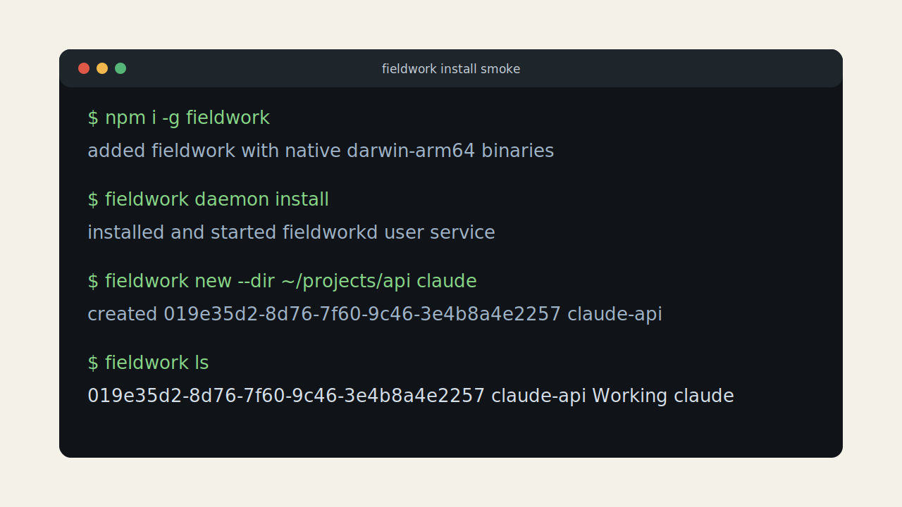
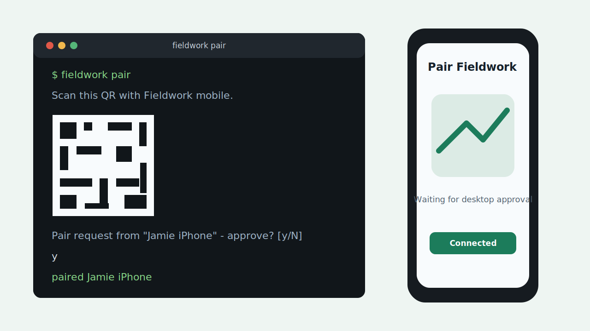
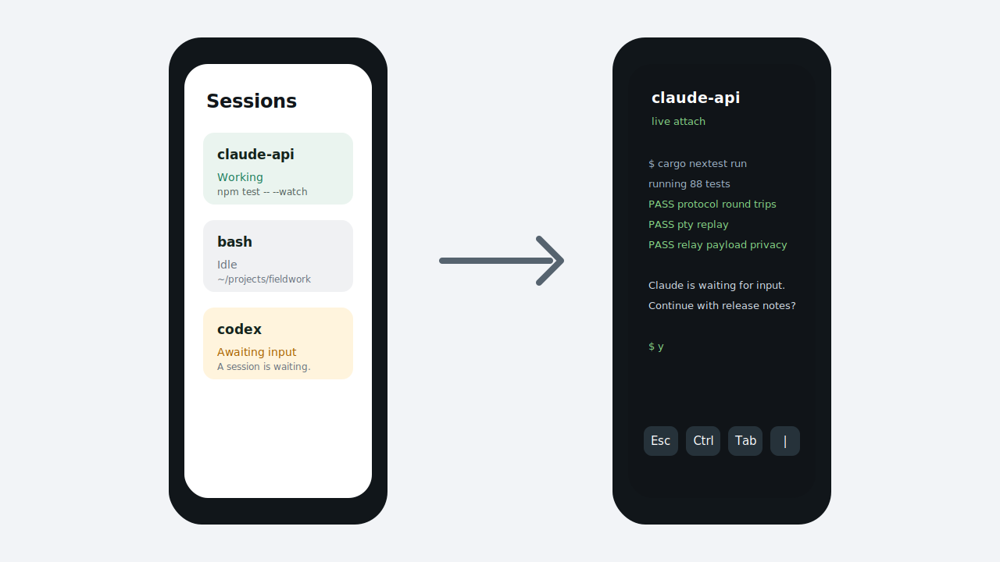

# Fieldwork

Your terminal sessions, from anywhere.

Fieldwork v1 is being built as a daemon plus CLI plus native mobile apps for universal terminal handoff. The current implementation covers the local daemon loop, iroh pairing, the UniFFI mobile core, native iOS/Android app sources, and the first relay push gateway path: `fieldworkd` owns PTY sessions, `fieldwork` creates/lists/attaches over a hardened Unix socket, and paired iroh clients can authenticate, list, attach, and stream PTY bytes over MessagePack.

## Install

```sh
npm i -g fieldwork
fw daemon install
fw pair
```

The npm package installs `fieldwork`, the shorter `fw` alias, and `fieldworkd`
together. `fw` accepts the same arguments as `fieldwork` (`fw pair`,
`fw new bash`, `fw attach <session-id>`). `fw refactoringjob` is the named
session fast path: attach if that session exists, otherwise create a default
`claude` PTY named `refactoringjob` and attach. Running `fieldwork` or `fw` with
no subcommand creates and attaches a default `claude` session with a generated
one-word name like `waffle` or `kazoo` when none exist, attaches the only
existing session, or lists sessions when there are several. The generated or
chosen session name is stored in the daemon summary, so it appears as the active
session name in the mobile app dashboard. The daemon rejects duplicate session
names, so a named shortcut always resolves to one PTY.
Desktop distribution is npm-only for v1; Homebrew, `curl | sh`, `cargo install`, and self-update are intentionally out of scope.

## Screenshots







## Demo Video

The local v1 demo video is generated from the repository screenshot assets:
[`docs/assets/fieldwork-demo-v1.mp4`](docs/assets/fieldwork-demo-v1.mp4).
Regenerate it with `pnpm render:demo-video` and verify duration, codec, and
dimensions with `pnpm check:demo-video`.

## Website

The `fieldwork.dev` site source lives in `site/` as a static Astro project. It covers install, architecture, protocol, and privacy pages and is wired into CI with `pnpm check:site`. Domain ownership, DNS control, and Cloudflare Pages credentials are operator-owned release gates; the local domain status script is reserved for an explicit operator-requested refresh, not routine agent verification.

## Release Status

The current v1 prompt-to-artifact checklist and remaining external release gates are tracked in [`docs/RELEASE_AUDIT.md`](docs/RELEASE_AUDIT.md), while `PLAN.md` remains the completion-checkbox source of truth. The product security model is in [`docs/SECURITY.md`](docs/SECURITY.md); vulnerability reporting stays in the root [`SECURITY.md`](SECURITY.md).
The operator-facing release-gate handoff lives in [`docs/OPERATIONS.md`](docs/OPERATIONS.md), including operator-owned reservations for domain, GitHub, social, cloud, provider, and launch-calendar work.
The first operator-assisted Android physical-device handoff pass is defined in [`docs/LIVE_TESTING.md`](docs/LIVE_TESTING.md).

## Current Local Flow

```sh
cargo build --workspace
target/debug/fieldwork
target/debug/fieldwork refactoringjob
target/debug/fieldwork new --name shell bash
target/debug/fieldwork new bash
target/debug/fieldwork ls
target/debug/fieldwork attach <session-id>
```

With no subcommand, the CLI uses the same smart default as the npm `fw` alias
and auto-names a new default session with a short one-word name.
With an unknown single word, it uses the named session shortcut described above.
Inside `attach`, press `Ctrl-B` then `D` to detach without killing the session.

The daemon persists session summaries and scrollback locally in encrypted `redb` storage using an OS-keychain-held key. Paired device records live in a separate encrypted `devices.redb`, with hashed row keys so raw device node IDs and push tokens live only inside encrypted row payloads. Keychain prompts are only for local key material; terminal output, keystrokes, commands, paths, session names, and push tokens are not stored there. The local persistence parent is `0700`, database files are `0600`, and symlinked persistence directories or database files are rejected before use. `fieldwork settings scrollback-encryption off` is the explicit opt-out path for environments where keychain-backed encryption is unavailable; after daemon restart, future session scrollback and device-registry writes are plaintext until the setting is turned back on. After a daemon restart, completed sessions can be listed and attached for scrollback replay, but their PTY process is correctly reported as exited.

Live sessions keep a daemon-side WezTerm terminal model. Warm reconnects replay raw bytes from the 256 KB ring; stale attaches get a synthetic ANSI snapshot so full-screen TUIs have a correct current viewport instead of relying on incomplete scrollback.

Daemon lifecycle commands currently include `fieldwork daemon start`, `status`, `logs`, `install`, `restart`, and `uninstall`. Service install is user-level only.

Shell completions are generated for the invoked command name:
`fieldwork completion bash|zsh|fish|powershell|elvish` registers the long
command, while `fw completion bash|zsh|fish|powershell|elvish` registers the
short alias.

Claude/Codex state hooks are local CLI adapters for this milestone. Claude Stop hooks can run `fieldwork hook claude-stop --session "$FIELDWORK_SESSION_ID"`, and Codex structured events can be piped into `fieldwork hook codex-event`.

## Current Pairing Flow

```sh
target/debug/fieldwork pair
```

The CLI prints a QR plus the JSON payload, waits for an incoming device request, and prompts for explicit approval. Pair tokens are 32 random bytes, base32 encoded, single-use, and expire after 10 minutes.

For headless transport smoke tests, the hidden Rust client can stand in for a phone:

```sh
scripts/smoke-local-handoff.sh
```

The script verifies iroh protocol-version mismatch rejection, pairs the hidden iroh phone simulator, creates and attaches to a default `claude` session, a `bash` session, and a `vim` TUI session, verifies the simulated phone is forbidden from creating sessions, killing sessions, or emitting agent-state hook events, removes the simulated device, verifies the same identity is rejected, then restarts the daemon and checks last-known session restore. The daemon stores its long-lived iroh secret in the OS keychain and stores paired device records in encrypted `devices.redb` under hashed row keys. Headless CI or local smoke tests may set `FIELDWORK_IROH_SECRET_KEY_B64` to a 32-byte no-padding base64 seed to avoid non-interactive keychain prompts; production runs should leave it unset. Remote clients are accepted over iroh only after pairing; mobile-kind clients cannot create sessions, kill sessions, or emit agent-state hook events.

`fieldwork-mobile-core` exposes the same iroh client path through UniFFI for Swift/Kotlin. `apps/ios` now contains a SwiftUI v0 app with QR pairing, data-protection Keychain-backed pairing persistence, biometric-only Face ID/Touch ID gating, a lock-only unauthenticated root, session list, SwiftTerm terminal attach/input/resize/detach, and unlock-gated APNs token registration plumbing. `apps/android` now contains the Compose v0 target with CameraX QR pairing, backup-excluded EncryptedSharedPreferences pairing persistence, biometric-only BiometricPrompt gating, a lock-only unauthenticated root, session list, termlib terminal attach/input/resize/detach, and unlock-gated FCM token registration plumbing.

For relay-push development, run `fieldwork-relay` locally and set `FIELDWORK_RELAY_CONTROL_URL=http://127.0.0.1:8443` for `fieldworkd`. The relay persists daemon public keys, push-token ownership, and recent replay nonces in SQLite; by default it uses `/var/lib/fieldwork/relay.db`, so local dev usually sets `FIELDWORK_RELAY_DB_PATH="$(mktemp -d)/relay.db"` or `FIELDWORK_RELAY_DB_PATH=off` for in-memory smoke tests. Push-token ownership rows are refreshed on accepted push dispatch and pruned after 90 days with no use. The daemon stores a relay-signing Ed25519 key in the OS keychain, registers push tokens with the relay, and posts hashed `AwaitingInput` events with bounded 60-second exponential retry for transport and temporary relay failures. The local relay validates signatures, nonce replay, clock skew, token ownership, bounded TTL rate limits, lowercase 64-character hex session hashes, payload privacy, and exposes aggregate-only metrics on `127.0.0.1:9090`; real APNs/FCM provider delivery requires relay-only Apple/Firebase credentials and physical-device verification.

The same `fieldwork-relay` binary can run the iroh fallback relay with `FIELDWORK_RELAY_MODE=iroh-relay`. The production Ansible scaffold runs it as a second systemd unit with ACME HTTPS on `:443`, HTTP probe/challenge handling on `:80`, QUIC address discovery on `:7842`, and separate aggregate metrics on `127.0.0.1:9091`.

Relay provider support is relay-only. APNs loads the `.p8` key through systemd credentials or an explicit relay env path, caches the ES256 provider JWT for 50 minutes, and sends only fixed copy plus opaque session hashes through a persistent provider client with HTTP/2 keepalive pings. APNs `BadDeviceToken` responses remove the relay token binding from memory and SQLite before the relay reports a provider error to the daemon. FCM loads the Firebase service-account JSON through the same relay-only credential path, exchanges a signed RS256 JWT for a cached OAuth token, sends the same privacy-preserving payload contract through the same keepalive client policy, and prunes FCM `UNREGISTERED` tokens as stale bindings.

Daemon telemetry is off by default. `fieldwork settings telemetry on --sentry-dsn <dsn>` persists consent in the user config file, and `fieldwork settings telemetry off` disables it again. `FIELDWORK_TELEMETRY_OPT_IN=true` plus `FIELDWORK_SENTRY_DSN` remains available as an environment override for local smoke tests. The daemon reads telemetry settings on startup, so restart `fieldworkd` after changing them.

The npm-only desktop distribution scaffold is present under `packages/`: `fieldwork` plus the four v1 platform packages. The meta package uses optional dependencies, postinstall binary copy/swap, and a dispatcher fallback for `--omit=optional` installs. The CLI checks the npm registry at most once per day for human-facing commands and prints a non-fatal `npm update -g fieldwork` notice to stderr when a newer version exists. The production npm publish, Oracle relay deployment, TestFlight, and Play internal release workflows are scaffolded but require external credentials and hosted infrastructure before they can run end to end. Relay deployment, provider credential rotation, and incident response are documented in [`docs/OPERATIONS.md`](docs/OPERATIONS.md).
